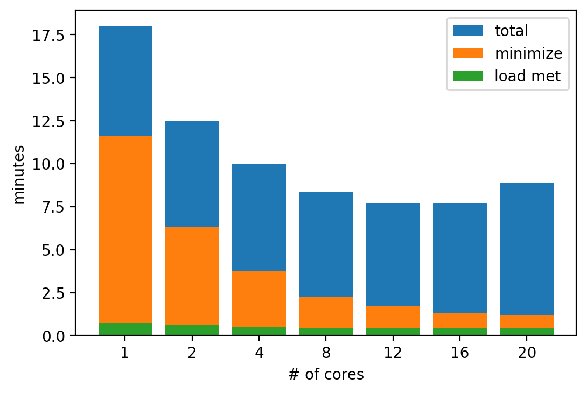

# SAMURAI Speed Testing

Due to the complex variational analysis in SAMURAI, the multi-Doppler analysis is one of the slowest parts of the SWANN workflow. SAMURAI does use OpenMP for multiprocessing to speed up computation time.

To determine the optimum number of cores, we ran the same SWANN leg with an increasing number of cores.

## Speed test results

Queue submission and resource allocation were handled by Slurm on a local CSU HPC system. The total runtime was reported by Slurm, while the minimize and loadMetObs runtimes were reported by SAMURAI. The time to load tensorflow varies from run to run, which introduces additional variations in the length of time to run SWANN.

Slurm specs: 1 node, cpus-per-task ranging from 1 to 20, 20 GB memory.

_SAMURAI speed test results. Total indicates the the runtime of the full SWANN workflow. Minimize is the time required for the 3D minimization step. LoadMetObs is the time required to load in all the observations._

Although the SAMURAI components decrease up to the maximum 20 cores, the gains are reduced above ~16 cores. But in terms of the total runtime, anything above 8 cores is likely sufficient for realtime purposes. 

## SWANN SAMURAI specs

In addition to available processors, SAMURAI speed depends on the size of the domain and the amount of data. The details for the SWANN SAMURAI setup are provided below.

- Case: Lee (2023), 1215 - 1330 UTC 12 September 2023

- Data: NOAA P3 HDOBs and QC'd TDR radials.

- Domain size (grid points): 150 x 150 x 13

- Filters: <4,4,2> and <2,2,2>

- Spline Cutoffs: <2,2,2> and <2,2,2>